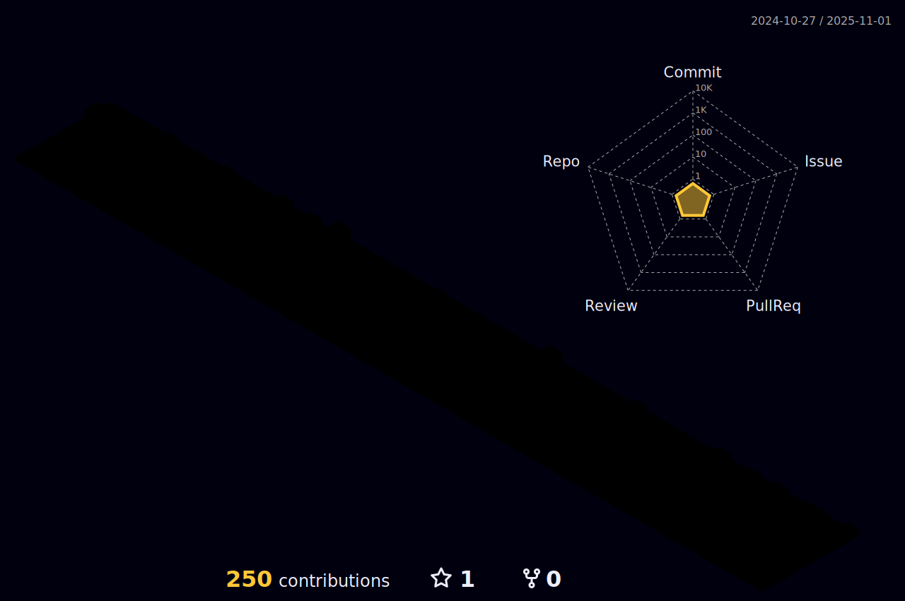

# sahmedG

Hello! My name is Sameer Tharwat Ahmed, I'm a computer Engineering graduate 2011 with GPA 83% ranked top 4th in my class.

I'm passionate about using technology to solve real-world problems and to take a challenging and high-performance oriented role in the field of IT and implement the expertise and experience gained in this field to develop complex projects with efficiency andquality.

## 🎓 Education

- **Bachelors in Computer Engineering**\
  Modern academy for Engineering and Technology
  Egypt\ 🇪🇬\
  
- **Full-Stack Developer Course/cyper security**\
  Reboot01\Bahrain 🇧🇭\
  _(Current)_

## 💼 Work history
2017 – Present Freelancer Software Engineer | system admin

● Designed and implemented database for supermarket using Oracle 12c.
● Designed and implemented web-based application with database for vape-shop
using Oracle 12c and APEX.
● Developed POS for electronics shop using visual basic.
● Worked on project to ingest raw data from MATOMO using HTTP API into
database hosted on the client web server for further data analysis using
anaconda.
● Designed the network and installed hardware/software for startup company
centralized server with data redundancy.
● Helped in migrating data from current server to newly installed server with
configuring the server.
● Worked with a team to upgrade the network solutions in a company overseas with
migrating the configuration from old routers and switches to the new setup.

2014 – 2016 Software Developer | Application developer
King Hamad University hospital ... Kingdom of Bahrain 🇧🇭\

● Developed HIS system for the hospital using oracle APEX
● System coordinator
● HIS helpdesk supervisor
● PACs system admin for MEDAVIS diagnostic imaging
● Integration officer on rhapsody
● PC (hardware/software) support
2013 – 2013 Software Developer | Web Developer

Egypt Cement Company
● Design and develop a fully functioning website for the company using CodeIgniter
as framework
Egypt 🇪🇬

## 💼 Professionate Skills

- Programing Java, Oracle SQL &PL/SQL
- Web development CSS, HTML5, JavaScript, PHP, Oracle APEX
- System administration Windows server
- Networking Administration and maintenance, Ethical hacking
- Data Analysis Anaconda
- Maintenance Pcs, laptops and printers (hardware/software)
- Git & GitHub

## 📜 Professional certificates

Software Engineering: Java programming, IBM web design, Data Science Engineer, APEXoracle
Engineering: CCNA, Ethical hacker (self-study)
IT: MCSA, CCTV (self-study)

## 🌍 Languages

- Arabic (Native)
- English (Fluent)

## 📫 Get in touch
- [LinkedIn](www.linkedin.com/in/sameer-goumaa)
- [Email](mailto:engsameergoumaa@gmail.com)
- [HTB](https://app.hackthebox.com/profile/1747462) 
# My stats so far

 
 

## 📚 Repositories

Check out my [GitHub Repositories](https://github.com/sahmedG?tab=repositories) to see my latest projects and collaborations.
